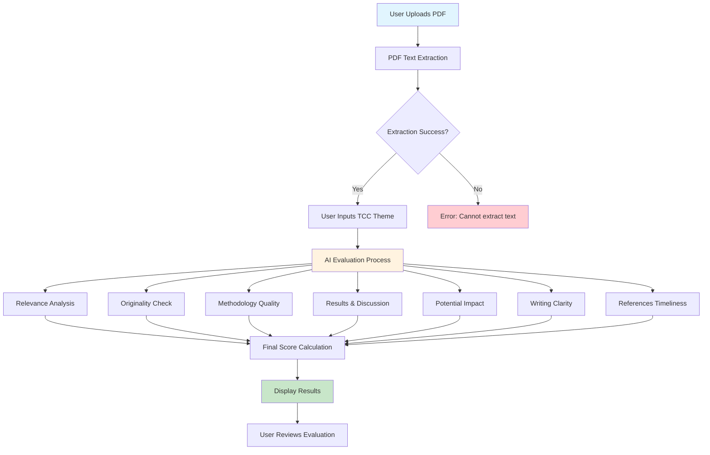
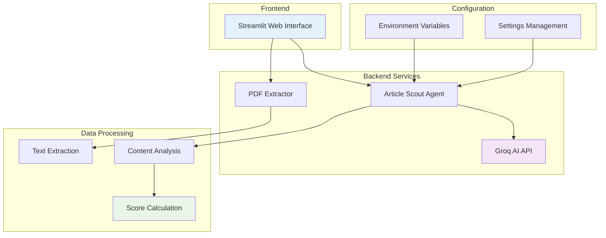

# Article Scout 🚀

[](https://www.python.org/)
[](https://streamlit.io/)
[](https://www.docker.com/)
[](LICENSE)
[](https://github.com/astral-sh/uv)
[](https://groq.com/)
[](https://github.com/psf/black)

Research Paper Evaluator for TCC - A tool to evaluate research papers for relevance to Final Project themes.

## 📊 Application Flow



## 🏗️ Architecture Overview



## 📁 Project Structure

```
article_scout/
├── src/
│   └── article_scout/          # Main application code
│       ├── __init__.py
│       ├── main.py            # Application entry point
│       ├── article_scout_agent.py
│       ├── streamlit_app.py   # Web interface
│       └── utils/             # Utility modules
│           ├── __init__.py
│           └── pdf_extractor.py
├── config/                    # Configuration files
│   ├── settings.py
│   ├── env.example
│   └── .python-version
├── scripts/                   # Utility scripts
│   ├── dev.sh
│   └── build.sh
├── docs/                      # Documentation
│   ├── README.md
│   └── LICENSE
├── data/                      # Data and examples
│   ├── examples/
│   └── input_files/
├── tests/                     # Test files
├── docker/                    # Docker configuration
│   └── Dockerfile
├── pyproject.toml            # Project configuration
├── uv.lock                   # Dependency lock file
└── README.md                 # This file
```

## 🚀 Quick Start

### Prerequisites

- Python 3.12+
- Docker (optional)
- Groq API key

### Installation

1. **Clone the repository**
   ```bash
   git clone <repository-url>
   cd article_scout
   ```

2. **Install dependencies**
   ```bash
   uv sync
   ```

3. **Configure environment**
   ```bash
   cp config/env.example .env
   # Edit .env with your GROQ_API_KEY
   ```

4. **Run the application**
   ```bash
   # Using the development script
   ./scripts/dev.sh
   
   # Or directly
uv run python -m streamlit run src/article_scout/streamlit_app.py
   ```

## 🐳 Docker

### Build and run with Docker

```bash
# Build the image
./scripts/build.sh

# Run with environment variables
docker run -p 8501:8501 -e GROQ_API_KEY=your_key article-scout:latest

# Or with .env file
docker run -p 8501:8501 --env-file .env article-scout:latest
```

## 🧪 Testing

```bash
# Run all tests
uv run pytest tests/ -v

# Run specific test
uv run pytest tests/test_pdf_extraction.py -v
```

## 🔧 Development

### Available Commands

```bash
# Show all available commands
make help

# Install dependencies
make install

# Run tests
make test

# Format code
make format

# Run linting
make lint

# Clean cache files
make clean

# Build Docker image
make build

# Run application locally
make run

# Run with Docker
make docker-run
```

### Code Quality

The project uses several tools to maintain code quality:

- **Black**: Code formatting
- **isort**: Import sorting
- **flake8**: Linting
- **pre-commit**: Git hooks for quality checks

## 📚 Features

### 🔍 PDF Processing
- Multi-method text extraction (PyPDF2, pdfminer.six, PyMuPDF)
- Automatic fallback mechanisms
- Token limit management

### 🤖 AI Evaluation
- Relevance to TCC theme analysis
- Originality assessment
- Methodology quality evaluation
- Results and discussion analysis
- Potential impact assessment
- Writing clarity evaluation
- References timeliness check

### 📊 Scoring System
- Comprehensive scoring across 7 criteria
- Weighted final score calculation
- Detailed explanations for each criterion

### 🌐 Web Interface
- User-friendly Streamlit interface
- Real-time PDF upload and processing
- Interactive results display
- Error handling and user feedback

## 🔑 Configuration

### Environment Variables

| Variable | Description | Default |
|----------|-------------|---------|
| `GROQ_API_KEY` | Groq API key (required) | - |
| `GROQ_MODEL` | AI model to use | `llama-3.1-8b-instant` |
| `GROQ_TEMPERATURE` | AI response randomness | `0.3` |
| `MAX_TOKENS` | Maximum tokens for processing | `5000` |
| `MAX_INPUT_CHARS` | Maximum input characters | `5000` |

## 📚 Documentation

- [Technical Diagrams](docs/technical-diagrams.md) - Detailed architecture and flow diagrams
- [Project Documentation](docs/) - Additional project documentation

## 🤝 Contributing

1. Fork the repository
2. Create a feature branch
3. Make your changes
4. Add tests
5. Submit a pull request

### Development Setup

```bash
# Clone and setup
git clone <repository-url>
cd article_scout
make setup

# Install pre-commit hooks
pre-commit install

# Start development
make dev
```

## 📄 License

This project is licensed under the MIT License - see the [LICENSE](docs/LICENSE) file for details.

## 🙏 Acknowledgments

- **Groq** for providing the AI API
- **Streamlit** for the web framework
- **LangChain** for AI integration tools
- **PyMuPDF** for PDF processing capabilities
