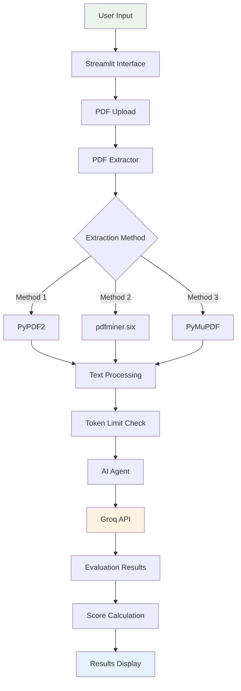
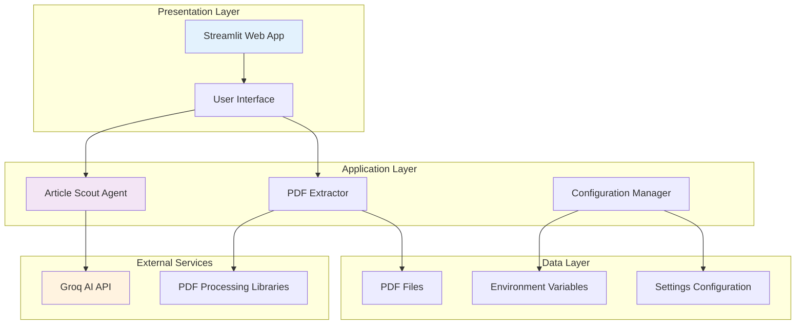
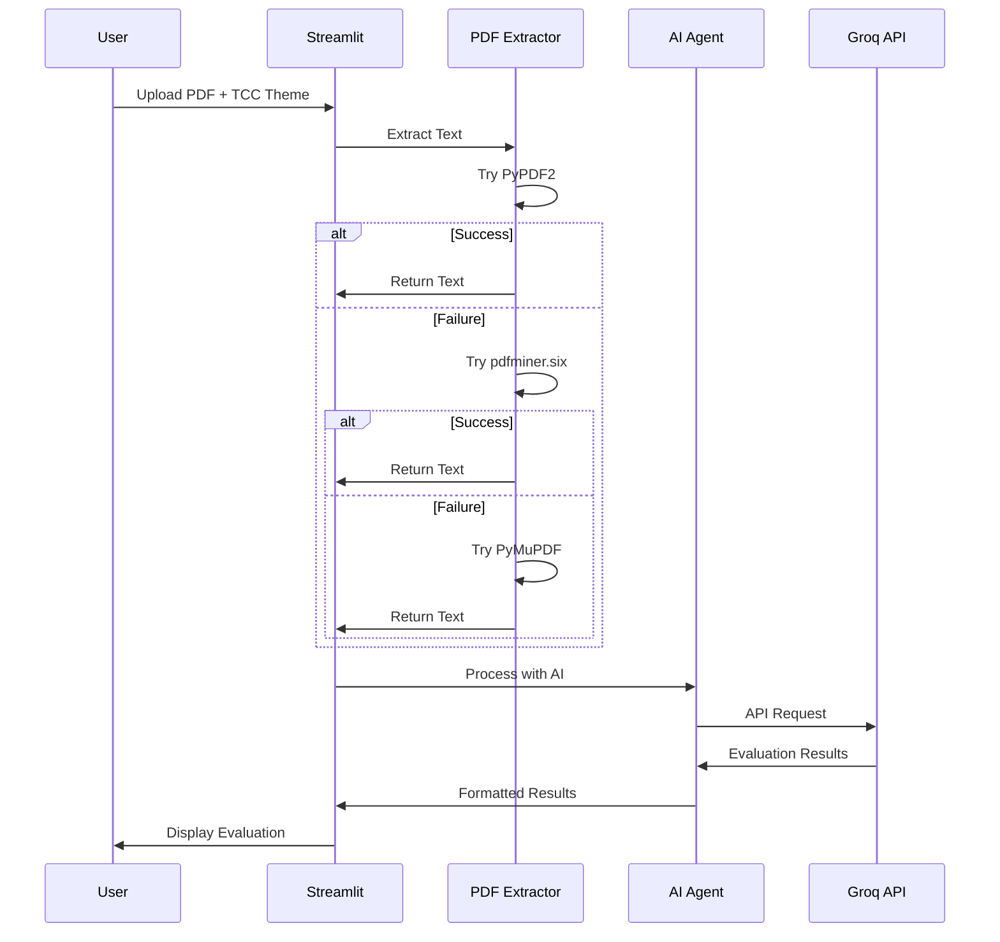
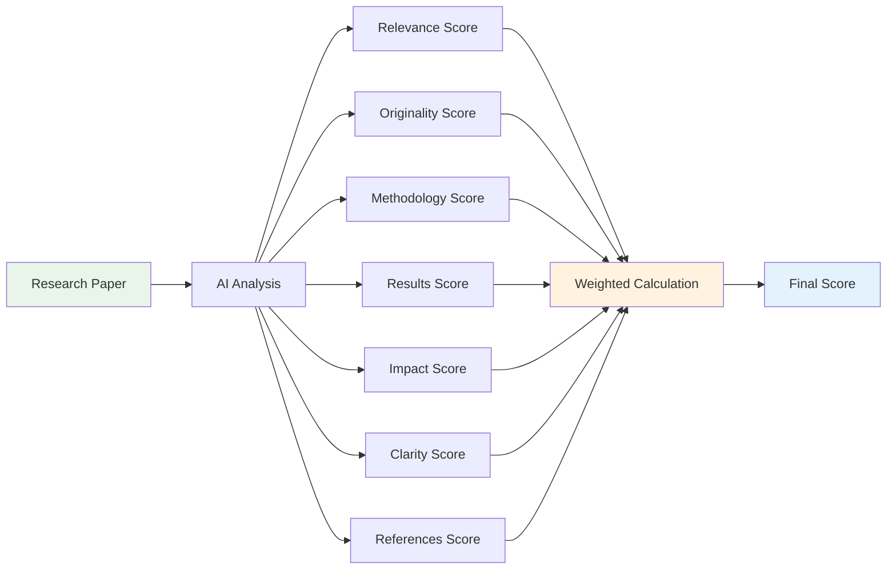
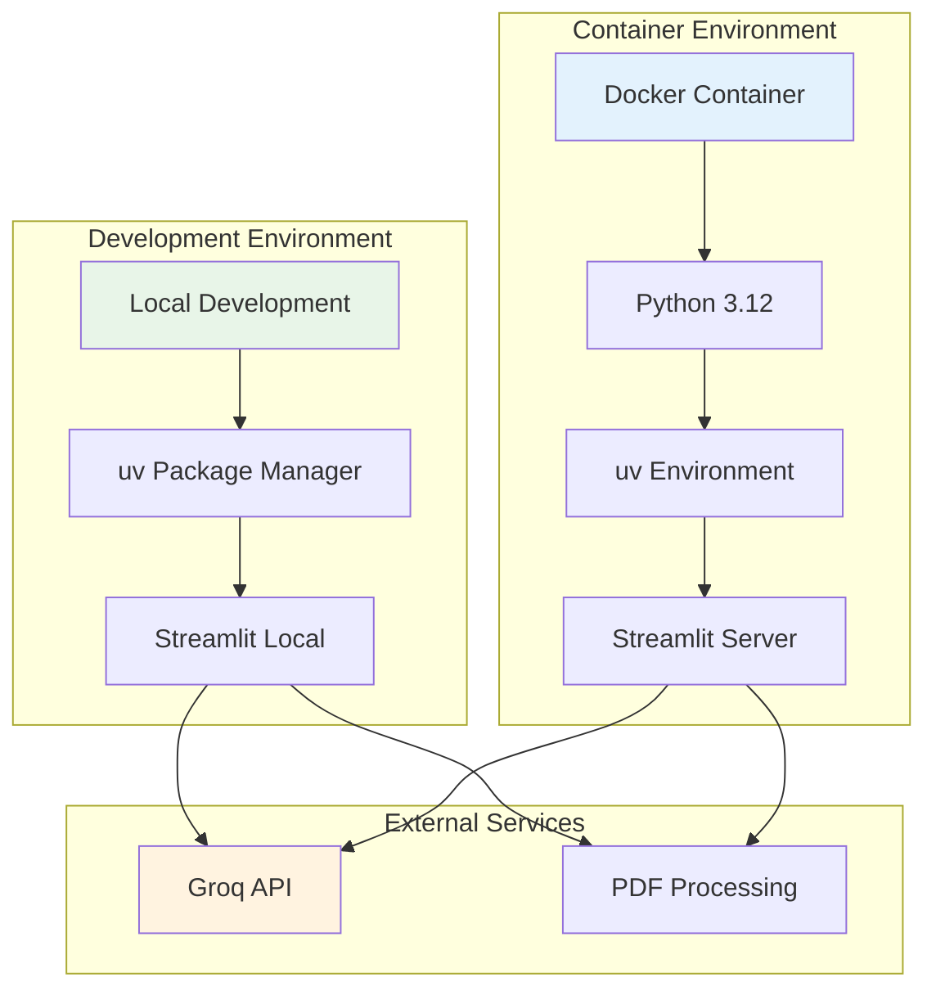
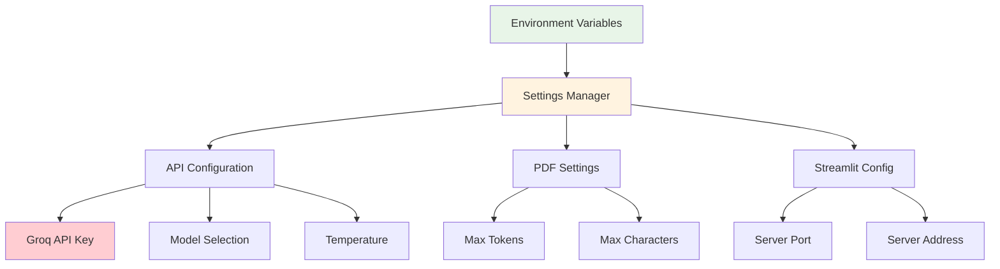
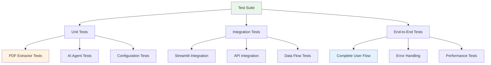

# Technical Diagrams 📊

This document contains detailed technical diagrams for the Article Scout project.

## 🔄 Data Flow Diagram

## 🏗️ Component Architecture

## 🔍 PDF Processing Pipeline

## 📊 Evaluation Criteria Flow

## 🚀 Deployment Architecture

## 🔧 Configuration Management

## 🧪 Testing Strategy

